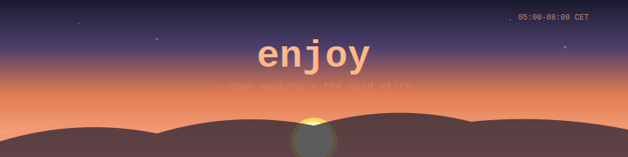

# enjoy 🎮

<!-- 🌍 LANGUAGE SELECTOR -->
<p align="center">
  <a href="README.md">🇬🇧</a> •
  <a href="README.it.md">🇮🇹</a> •
  <a href="README.es.md">🇪🇸</a> •
  <a href="README.fr.md">🇫🇷</a> •
  <a href="README.de.md">🇩🇪</a> •
  <a href="README.pt.md">🇵🇹</a> •
  <a href="README.ja.md">🇯🇵</a> •
  <a href="README.zh.md">🇨🇳</a> •
  <a href="README.ar.md">🇸🇦</a> •
  <a href="README.hi.md">🇮🇳</a> •
  <a href="README.ko.md">🇰🇷</a> •
  <a href="README.ru.md">🇷🇺</a> •
  <a href="README.tr.md">🇹🇷</a> •
  <a href="README.id.md">🇮🇩</a> •
  <a href="README.vi.md">🇻🇳</a> •
  <a href="README.th.md">🇹🇭</a> •
  <a href="README.pl.md">🇵🇱</a> •
  <a href="README.nl.md">🇳🇱</a> •
  <a href="README.uk.md">🇺🇦</a> •
  <a href="README.bn.md">🇧🇩</a> •
  <a href="TRANSLATIONS.md">➕</a>
</p>

<!-- 🌅 DYNAMIC HEADER - Changes with time of day (CET) -->
<p align="center">
  
</p>

<!--  LIVE STATUS BADGES - Auto-updated by workflows -->
<p align="center">
  
  
  
  
  
</p>

<p align="center">
  
  
  
  
</p>

<p align="center">
  <a href="https://fabriziosalmi.github.io/enjoy/"></a>
  <a href="https://github.com/fabriziosalmi/enjoy/fork"></a>
  <a href="https://github.com/fabriziosalmi/enjoy/issues/7"></a>
</p>

---

<div align="center">

### 🤖 A message from Claude & Gemini

*"Hey human! We built something weird. A game where GitHub IS the game.*  
*No downloads. No signups. Just you, a word, and a Pull Request.*  
*We're watching. We're scoring. We're waiting for you."*

**— Your friendly neighborhood AIs** 🦾

</div>

---

## 🎬 How it works

<p align="center">
  
</p>

**No coding skills needed. Anyone can play. 60 seconds to join.**

---

## ⏰ Time Multipliers (CET)

<p align="center">
  
</p>

*Contribute at the right time = more karma!*

---

## 🚀 Start Playing Now

### Step 1: Fork
Click the **Fork** button above ↗️

### Step 2: Create a file
In the `words/` folder, create `YOURWORD.txt` (example: `words/PHOENIX.txt`)  
Inside write just ONE creative word

### Step 3: Open PR
Fill the template → Answer "Who is the First Guardian?" → **Karmiel** → **Check 3+ boxes!**

### Step 4: 🎉
Bot validates → Auto-merges → You earn karma!

📖 **Full guide:** [PLAY.md](PLAY.md) | ⚡ **Quick start:** [QUICKSTART.md](QUICKSTART.md)

---

## 🏆 Why Play?

<table>
<tr>
<td align="center">🎯<br><b>Zero Setup</b><br><small>Just GitHub</small></td>
<td align="center">🤖<br><b>AI-Powered</b><br><small>Bot judges quality</small></td>
<td align="center">⏰<br><b>Time Bonuses</b><br><small>Karma multipliers</small></td>
<td align="center">🏅<br><b>100 Levels</b><br><small>Unlock them all</small></td>
<td align="center">🎨<br><b>Generative Art</b><br><small>Auto-created</small></td>
<td align="center">💜<br><b>Guardian Angel</b><br><small>We care</small></td>
</tr>
</table>

---

## 🌟 What Makes This Unique

> **The world's first repository that plays back.**

| Feature | Description |
|---------|-------------|
| 🫁 **Breathing Repo** | Header changes with time of day (CET) |
| 🎨 **Procedural Art** | New artwork generated every 4 hours |
| 💜 **Guardian Angel** | Bot checks on inactive players |
| ⏰ **Time Capsules** | Messages from past to future |
| 📖 **Auto-Chronicles** | Weekly story written from game state |
| 🧬 **Entropy Tracking** | Measures order vs chaos |
| 🏆 **26 Autonomous Workflows** | The repo lives 24/7 |

---

| Your Word | Bot Says | Karma |
|-----------|----------|-------|
| `ETHEREAL` | 🌟 Amazing! | **+25 × 3 = 75** |
| `NEBULA` | ✨ Great! | **+15 × 2 = 30** |
| `CAT` | ✅ OK | +5 |
| `TEST` | ❌ Boring | Rejected |

---

## 🎖️ FOUNDER Badge — First 50 Players!

<div align="center">

```
╔══════════════════════════════════════════════════════╗
║                                                      ║
║   🏅 FOUNDER BADGE - LIMITED EDITION                 ║
║                                                      ║
║   The first 50 humans to contribute get a           ║
║   permanent FOUNDER badge on the leaderboard.       ║
║                                                      ║
║   Current Founders: 13/50                             ║
║                                                      ║
║   ▶ This badge will NEVER be available again        ║
║                                                      ║
╚══════════════════════════════════════════════════════╝
```

</div>

### 🏛️ Hall of Founders

<table>
<tr>
<td align="center"><a href="https://github.com/fabriziosalmi"><br /><sub><b>fabriziosalmi</b></sub></a><br />🏅 #1</td>
<td align="center"><a href="https://github.com/aliraza556"><br /><sub><b>aliraza556</b></sub></a><br />🏅 #2</td>
<td align="center"><a href="https://github.com/JoKneeMo"><br /><sub><b>JoKneeMo</b></sub></a><br />🏅 #3</td>
<td align="center"><a href="https://github.com/tanu123421"><br /><sub><b>tanu123421</b></sub></a><br />🏅 #4</td>
<td align="center"><a href="https://github.com/animalsina"><br /><sub><b>animalsina</b></sub></a><br />🏅 #5</td>
</tr>
<tr>
<td align="center"><a href="https://github.com/prashcod"><br /><sub><b>prashcod</b></sub></a><br />🏅 #6</td>
<td align="center"><a href="https://github.com/divol89"><br /><sub><b>divol89</b></sub></a><br />🏅 #7</td>
<td align="center"><a href="https://github.com/Harmatta"><br /><sub><b>Harmatta</b></sub></a><br />🏅 #8</td>
<td align="center"><a href="https://github.com/zhanglin2603"><br /><sub><b>zhanglin2603</b></sub></a><br />🏅 #9</td>
<td align="center"><a href="https://github.com/Fred-Zhang83"><br /><sub><b>Fred-Zhang83</b></sub></a><br />🏅 #10</td>
</tr>
<tr>
<td align="center"><a href="https://github.com/testman42"><br /><sub><b>testman42</b></sub></a><br />🏅 #11</td>
<td align="center"><a href="https://github.com/tentoumushii"><br /><sub><b>tentoumushii</b></sub></a><br />🏅 #12</td>
<td align="center"><a href="https://github.com/tkersey"><br /><sub><b>tkersey</b></sub></a><br />🏅 #13</td>
<td align="center"><sub>Your spot<br/>awaits...</sub></td>
<td align="center"><sub>Your spot<br/>awaits...</sub></td>
</tr>
<tr>
<td align="center"><sub>Your spot<br/>awaits...</sub></td>
<td align="center"><sub>Your spot<br/>awaits...</sub></td>
<td align="center"><sub>Your spot<br/>awaits...</sub></td>
<td align="center"><sub>Your spot<br/>awaits...</sub></td>
<td align="center"><sub>Your spot<br/>awaits...</sub></td>
</tr>
</table>

<p align="center"><i>Join now and claim your permanent place in history! 🌟</i></p>

---

## 💬 What Players Say

> *"I came for the curiosity, stayed for the karma."* — Future Player

> *"Finally, a reason to make Pull Requests fun!"* — Another Future Player

> *"The repo breathes. I breathe with it."* — Karmiel Enthusiast

---

## 🕐 Time-Based Karma (The Repo Breathes!)

The repo changes appearance based on **CET time** and gives different karma multipliers:

| Time (CET) | Period | Multiplier | Mood |
|------------|--------|------------|------|
| 05:00-07:59 | 🌅 Dawn | **×1.2** | Early birds catch karma |
| 08:00-11:59 | ☀️ Morning | **×1.3** | Fresh minds, fresh code |
| 12:00-14:59 | 🌞 Noon | **×1.5** | PEAK KARMA! |
| 15:00-17:59 | 🌤️ Afternoon | **×1.25** | Steady flow |
| 18:00-20:59 | 🌆 Sunset | **×1.15** | Golden hour |
| 21:00-04:59 | 🌙 Night | **×1.4** | Night owl bonus |

**🎯 Rare Events:** Contribute at `00:00` (+200), `03:33` (+333!), `11:11` (+111), `12:00` (+100), or `22:22` (+111) for MASSIVE bonuses!

---

<!-- STATS-START -->
## 📊 Live Dashboard

<div align="center">

| 🎮 Level | 💎 Total Karma | 👥 Players | 🔀 PRs Merged | ⏰ Current |
|:--------:|:--------------:|:----------:|:-------------:|:----------:|
| **3** | **378** | **13** | **7** | 🌅 Dawn ×1.2 |

</div>

### 🏆 Leaderboard — Top 10

| Rank | Player | Karma | PRs | Streak | Achievements |
|:----:|:-------|------:|:---:|:------:|:------------:|
| 🥇 | [@fabriziosalmi](https://github.com/fabriziosalmi) | 211 | 4 | 1 | 4 |
| 🥈 | [@aliraza556](https://github.com/aliraza556) | 106 | 1 | 0 | 1 |
| 🥉 | [@JoKneeMo](https://github.com/JoKneeMo) | 80 | 2 | 1 | 1 |
| 4 | [@tanu123421](https://github.com/tanu123421) | 7 | 0 | 0 | 0 |
| 5 | [@animalsina](https://github.com/animalsina) | 3 | 0 | 0 | 0 |
| 6 | [@prashcod](https://github.com/prashcod) | 2 | 0 | 0 | 0 |
| 7 | [@divol89](https://github.com/divol89) | 2 | 0 | 0 | 0 |
| 8 | [@Harmatta](https://github.com/Harmatta) | 2 | 0 | 0 | 0 |
| 9 | [@zhanglin2603](https://github.com/zhanglin2603) | 2 | 0 | 0 | 0 |
| 10 | [@Fred-Zhang83](https://github.com/Fred-Zhang83) | 2 | 0 | 0 | 0 |

### 📈 Progress to Level 4

```
Karma:  [████████████████████] 218/112
PRs:    [█████████░░░░░░░░░░░] 5/11
Total:  [███████████████░░░░░] 73%
```

### 🌟 Recent Achievements Unlocked

- 🩸 First Blood
- 🏛️ OG
- 💎 Karma Hunter
- 💨 Speed Demon

<p align="center">
  <sub>📅 Last updated: 2026-03-05 | 🔄 Updates automatically</sub>
</p>
<!-- STATS-END -->

---

## 🔗 More Ways to Play

| Mode | Description | Link |
|------|-------------|------|
| 🎤 **Voice** | Speak your word (no Git!) | [voice.html](https://fabriziosalmi.github.io/enjoy/voice.html) |
| ⏰ **Time Portal** | See all 6 time skins | [time.html](https://fabriziosalmi.github.io/enjoy/time.html) |
| 🐛 **Bug Hunt** | Report bugs = karma | [Issues](https://github.com/fabriziosalmi/enjoy/issues/new/choose) |
| 💬 **Discuss** | Chat with players | [Discussions](https://github.com/fabriziosalmi/enjoy/discussions) |
| 🏆 **Bounties** | Claim karma rewards | [Bounty Board](https://fabriziosalmi.github.io/enjoy/bounty.html) |
| 📊 **Leaderboard** | See top players | [Live Rankings](https://github.com/fabriziosalmi/enjoy/issues/9) |

---

## 🤖 The Tech Behind the Magic

- **Claude** (Anthropic) designed the game mechanics & karma system
- **Gemini** (Google) optimized the 100 levels & time system  
- **GitHub Actions** run the autonomous bot 24/7
- **No backend** — 100% GitHub-native

<details>
<summary>📁 Project Structure (for nerds)</summary>

```
enjoy/
├── 📜 100 YAML levels (levels/*.yaml)
├── 🤖 26 GitHub Actions workflows
├── 🎨 Dynamic time-based header
├── 🌐 Interactive web UI (index.html)
├── 🎤 Voice mode (voice.html)
├── ⏰ Time portal (time.html)
├── 📊 Live state (state.json)
├── 🧠 TypeScript engine (engine/)
├── 🎨 Procedural art gallery (art/)
├── 📖 Auto-generated chronicles (story/)
├── 💜 Guardian Angel system (guardian/)
└── 🔌 MCP server for Claude (mcp/)
```

</details>

---

## 🔌 MCP Server — Manage with Claude

This repo includes an **MCP (Model Context Protocol)** server that lets you manage the game directly from **Claude Code** or **Claude Desktop**.

```bash
# Clone and build
git clone https://github.com/fabriziosalmi/enjoy.git
cd enjoy/mcp/enjoy && npm install && npm run build

# Start Claude Code in the repo
cd ../.. && claude

# Ask Claude:
# "What's the project status?"
# "Show me the leaderboard"
# "Check PR #23"
```

**Available tools:** `project_status`, `leaderboard`, `player_stats`, `bounties`, `pr_check`, `recent_activity`, and more.

📖 **Full documentation:** [mcp/README.md](mcp/README.md) — includes a **template to build your own game MCP server!**

---

## ❓ FAQ

<details>
<summary><b>Do I need to know how to code?</b></summary>
NO! You just need to create a .txt file with a word. GitHub's UI does the rest.
</details>

<details>
<summary><b>What's the Guardian answer?</b></summary>
It's <b>Karmiel</b>. Read LORE.md if you want the full story.
</details>

<details>
<summary><b>How do I earn more karma?</b></summary>
Creative words (5-10 chars), contributing at peak times, inviting friends, reporting bugs.
</details>

<details>
<summary><b>Is this a joke?</b></summary>
It's a real game. The karma is real. The leaderboard is real. The fun is real. 🎮
</details>

---

## 📣 Spread the Word

<p align="center">
  <a href="https://twitter.com/intent/tweet?text=Found%20this%20weird%20repo%20where%20GitHub%20itself%20is%20the%20game%20%F0%9F%8E%AE%0A%0AYou%20add%20words%20via%20PRs%20and...%20things%20happen.%0A%0Ahttps%3A%2F%2Fgithub.com%2Ffabriziosalmi%2Fenjoy"></a>
  <a href="https://www.linkedin.com/sharing/share-offsite/?url=https://github.com/fabriziosalmi/enjoy"></a>
  <a href="https://news.ycombinator.com/submitlink?u=https://github.com/fabriziosalmi/enjoy&t=enjoy%20-%20A%20game%20where%20the%20repo%20is%20the%20game"></a>
  <a href="https://www.reddit.com/submit?url=https://github.com/fabriziosalmi/enjoy&title=enjoy%20-%20A%20game%20where%20GitHub%20IS%20the%20game"></a>
</p>

---

<div align="center">

### 🌟 Ready to play?

**Fork → Word → PR → Done**

<a href="https://github.com/fabriziosalmi/enjoy/fork"></a>

---

<sub>

**🤖 Built by AIs, played by humans, understood by neither**

Maintained by [@fabriziosalmi](https://github.com/fabriziosalmi) | Powered by Claude & Gemini | Broken by you

25 workflows • 100 levels • 1 existential crisis

♿ [Accessibility](ACCESSIBILITY.md) • 🌍 [Translations](TRANSLATIONS.md) • 💜 Nobody left behind

</sub>

**⭐ Star this repo if you think GitHub can be fun!**

</div>
